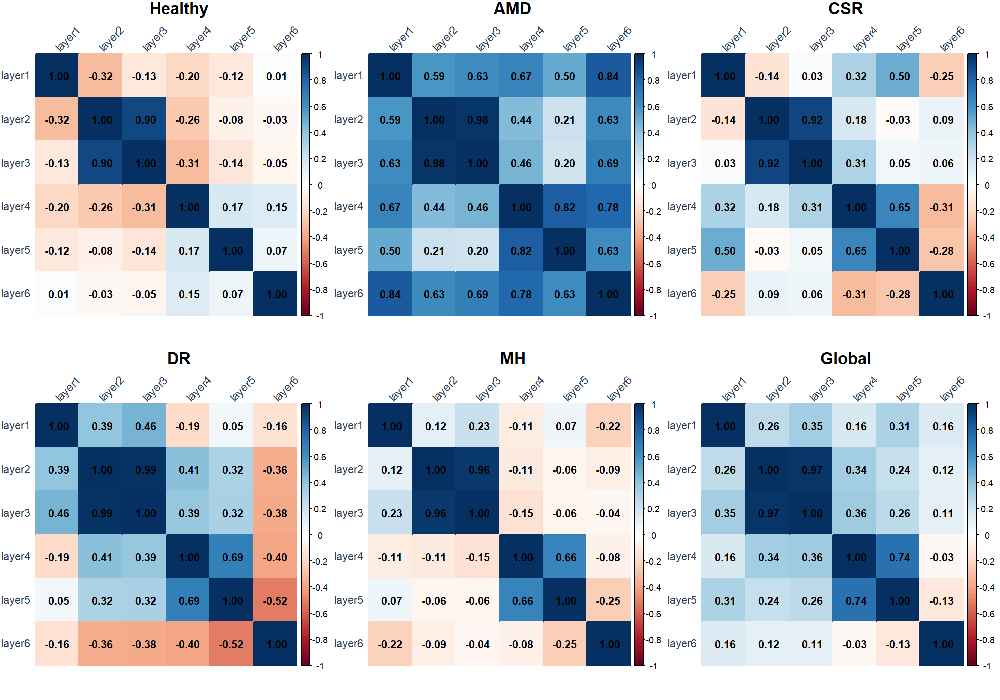
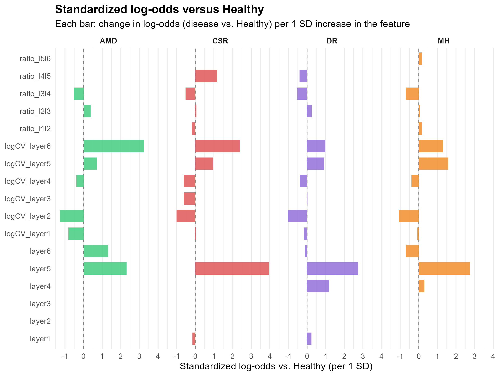
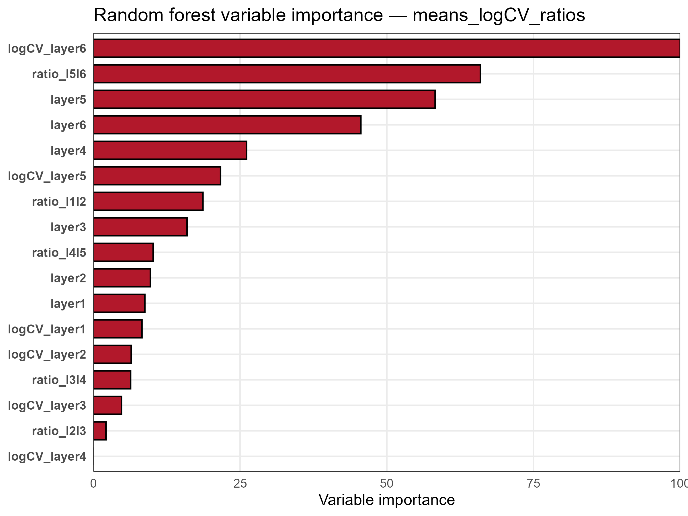
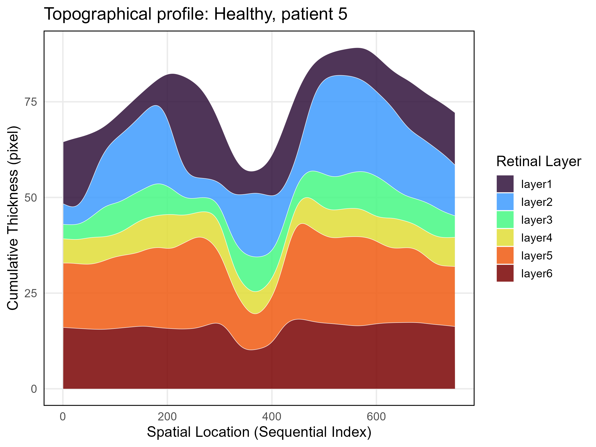
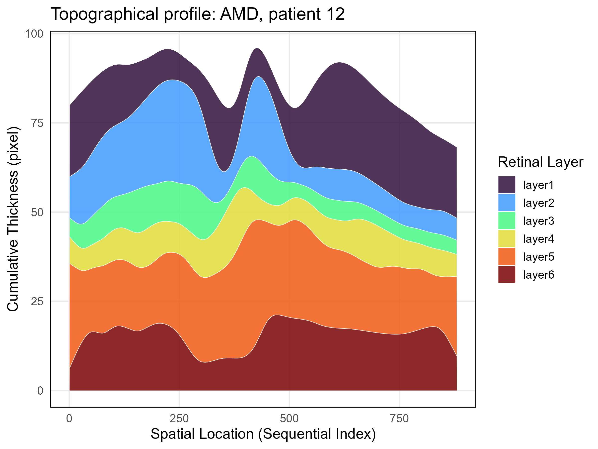
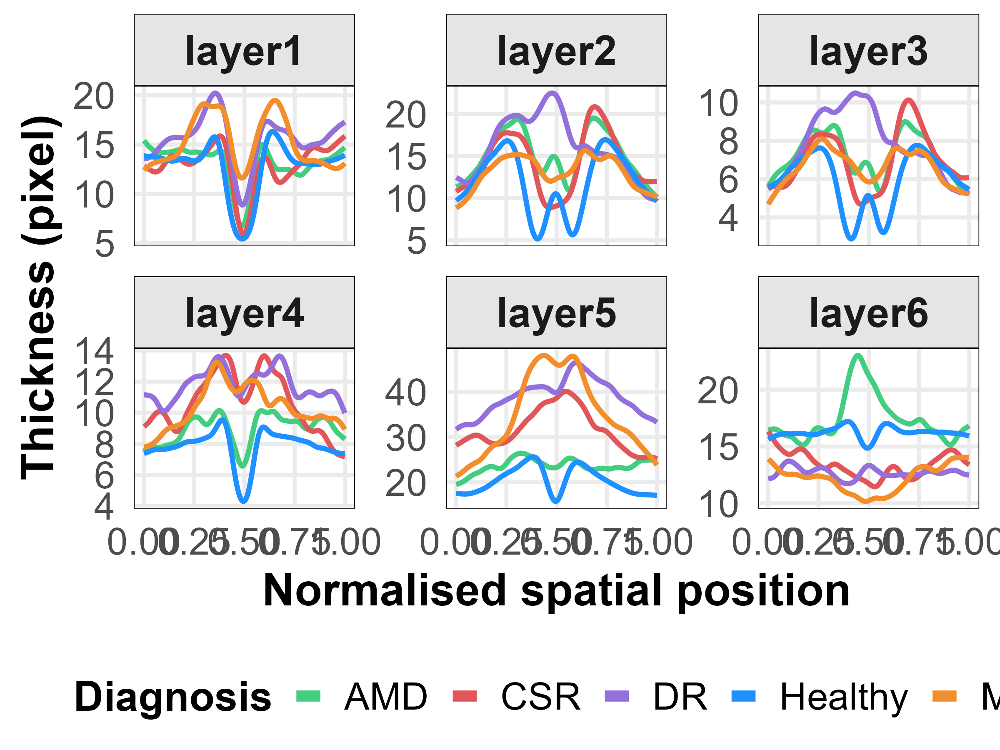
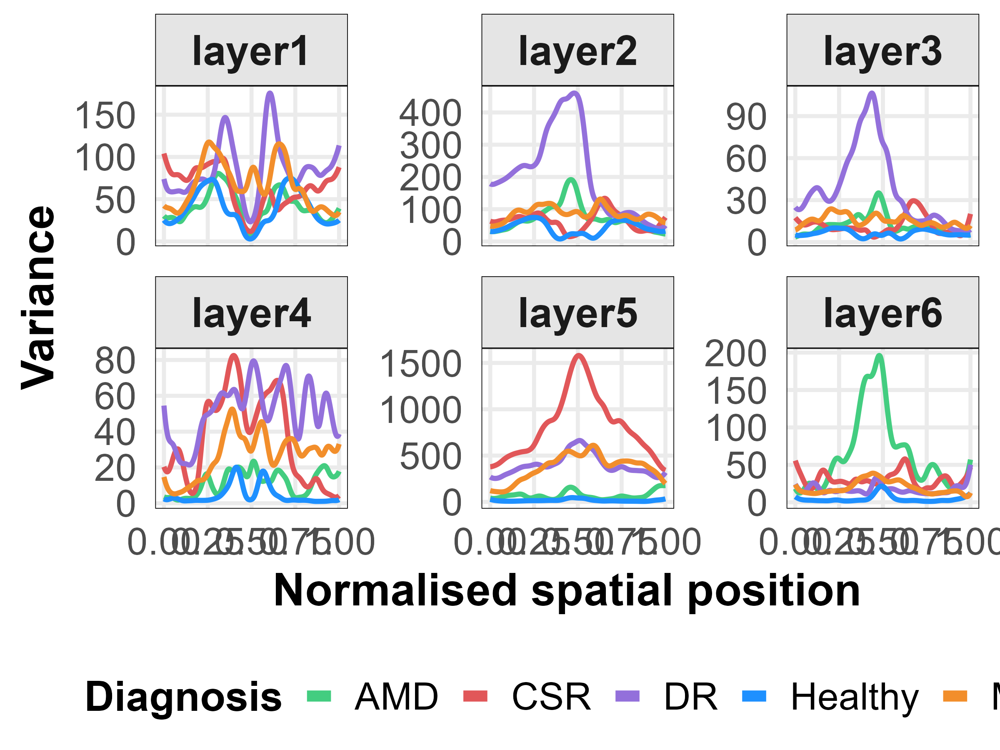
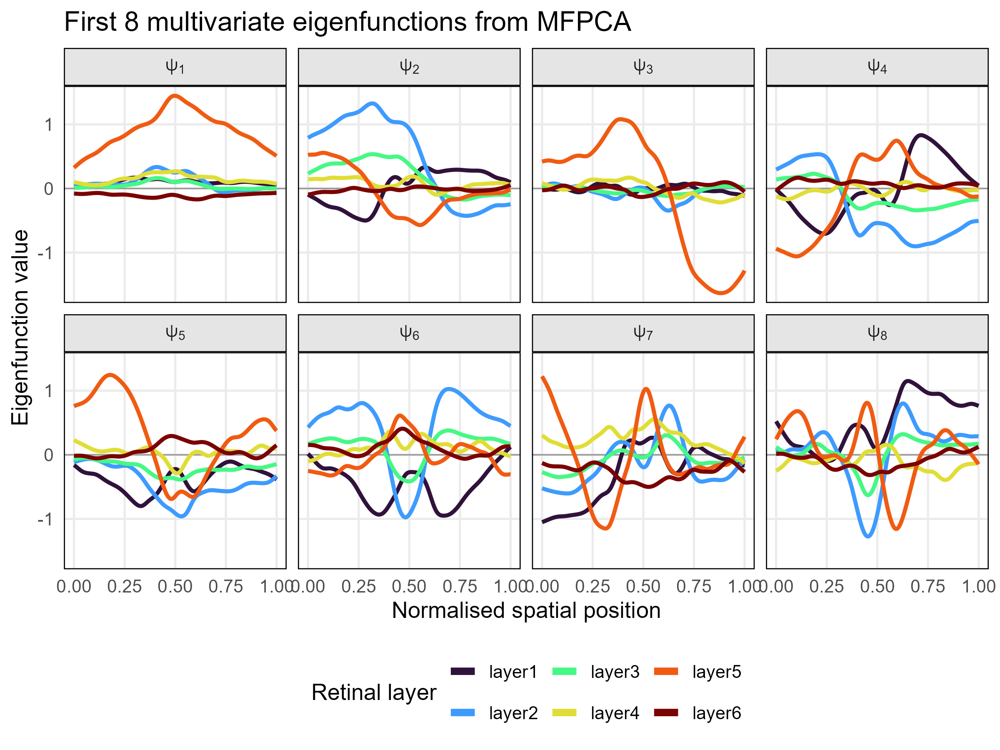
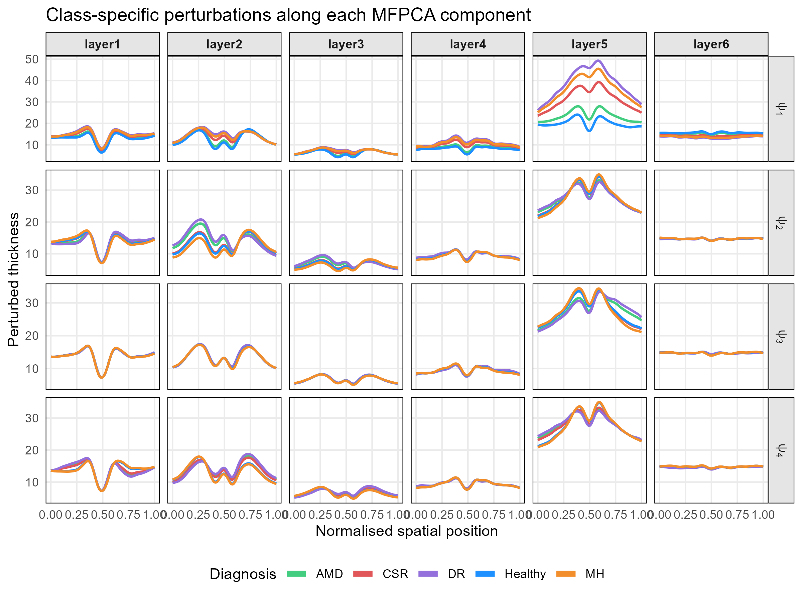
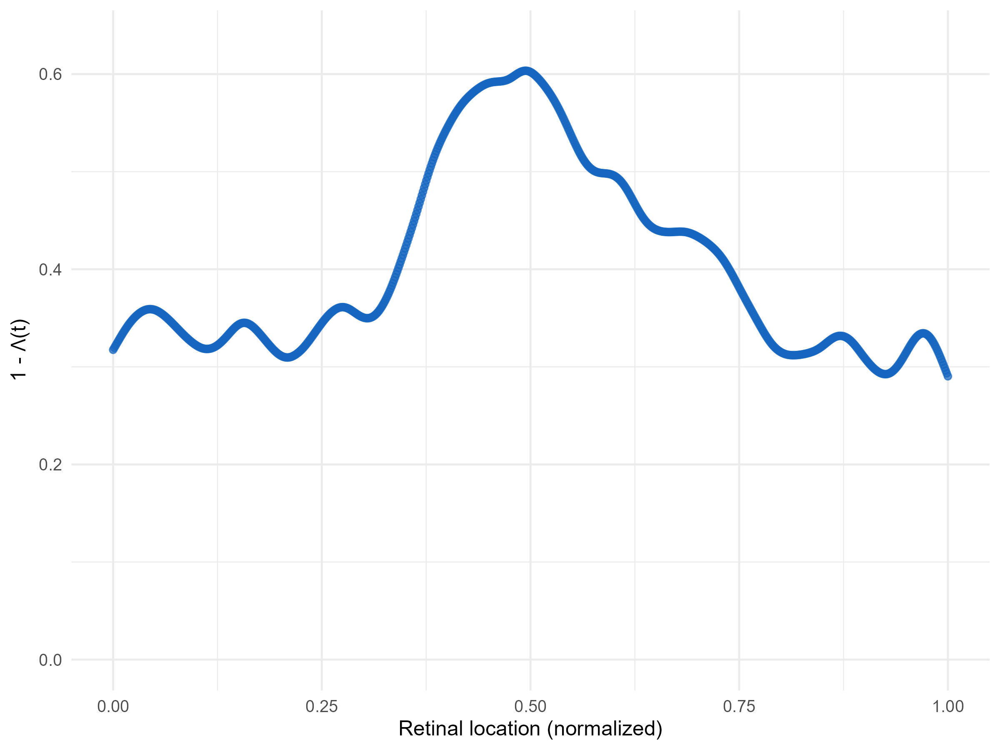

# Discovering Structural Biomarkers for Retinal Diseases

## Repository structure
```text
discovering-structural-biomarkers-for-retinal-diseases/
│
├── data/
│   └── PatientsData.xlsx              # raw dataset; not uploaded
│
├── R/
│   ├── packages.R                     
│   ├── fda_utils.R                    
│   ├── eval_utils.R                  
│   └── model_defs.R                  
│
├── scripts/
│   ├── 01_preprocessing.R             
│   ├── 02_eda_multivariate.R          
│   ├── 03_covariance_analysis.R      
│   ├── 04_baseline_models.R           
│   ├── 05_eda_functional.R            
│   ├── 06_fda_plots.R                 
│   └── 07_logreg_scores.R             
│
├── datasets/                          # processed .rds datasets; generated locally, not committed
│
├── results/                           # model outputs and .rds results; generated locally, not committed
│
├── figures/                           
│
├── .gitignore                         
├── .Rproj
└── README.md
```


## Dataset 

To evaluate whether different retinal diseases exhibit distinct structural patterns and to identify potential morphological biomarkers, this project utilizes a high-resolution dataset of retinal thickness measurements. The data is derived from Optical Coherence Tomography (OCT) scans, a non-invasive imaging technique that provides detailed cross-sectional views of the retina.

The dataset is highly structured to capture both the global anatomy and the localized topological features of the eye. For each patient in the study, the retina has been segmented into 6 distinct structural layers:

ilm - nflgcl      = inner retinal surface to RNFL/GCL complex  
nflgcl - iplinl   = ganglion cell + inner plexiform complex  
iplinl - inlopl   = inner nuclear layer  
inlopl - oplonl   = outer plexiform layer  
oplonl - isos     = outer nuclear / photoreceptor inner region  
isos - rpe        = photoreceptor outer segment to retinal pigment epithelium  

For each of these 6 layers, the dataset records the discrete thickness measured at 750 localized points along a horizontal cross-sectional axis. This translates to an extremely granular 1D functional profile for each layer, allowing us to investigate whether pathological deformations occur globally across the entire retina or are confined to highly localized areas.

The dataset comprises a total of 351 individuals, categorized into one healthy control group and four distinct pathological classes:
- Healthy: Control subjects with no retinal structural anomalies.
- AMD (Age-related Macular Degeneration): A disease typically affecting the central vision area (macula).
- CSR (Central Serous Retinopathy): Characterized by fluid accumulation under the retina.
- DR (Diabetic Retinopathy): A complication of diabetes affecting the blood vessels of the retina.
- MH (Macular Hole): A small break in the macula, causing blurred or distorted central vision.

The architecture of this dataset perfectly aligns with the project's core objectives. By having 6 parallel functional profiles per patient, we are not limited to analyzing layers in isolation. Instead, we can extract patient-specific covariance structures—measuring how the thickness of one layer correlates with another—and map them into specific geometric spaces (e.g., using Symmetric Positive Definite matrices and Riemannian distances).

By applying supervised learning algorithms , we aim to isolate the specific layers, spatial regions, and structural correlations that act as the strongest biomarkers. Identifying these precise structural signatures can ultimately serve as a powerful proxy for automated medical classification and early diagnosis.

## Multivariate data analysis

### Dataset Architecture & Feature Engineering
To transform the 878 raw spatial points of each retinal layer into optimized inputs for supervised machine learning models, we extract specific structural metrics from the 1D profiles:
* **Mean Layer Thickness (`layer1` to `layer6`):** Captures the global thickness of each layer for an individual patient by averaging their measurements
* **Standard Deviation (`sd_layer1` to `sd_layer6`):** Captures the spatial variability and roughness within each layer.
* **Layer Ratios (`ratio_l1l2` to `ratio_l5l6`):** The ratio of thickness between adjacent layers to capture spatial dependencies.
* **Log Coefficient of Variation (`logCV_layer1` to `logCV_layer6`):** Computed as $\log(\text{SD}/\text{Mean})$.

These engineered metrics are compiled into four distinct matrix configurations:
* `means`
* `means_sd`
* `means_sd_ratios`
* `means_logCV_ratios`

In addition to the macro-structural features, we engineered another feature dataset named `cor_pat_spec`. 
By calculating the correlations for all 6 layers, we unroll the upper triangle of the resulting $6 \times 6$ matrix into a 15-dimensional feature vector ($L1\text{-}2, L1\text{-}3, \dots, L5\text{-}6$). 

### Structural Covariance Analysis
Focusing on the mean thickness per layer of every patient, our first exploratory analysis has shown distributional differences between groups.

For an initial overview we recovered the correlation matrices between layer for each class observing the differences between healthy patients and diseases. The retinal structure is modified not only in terms of thickness but also in terms of relations between layers.

<p align="center">
  
</p> 

Going into detail, the interdependence between layers 2 and 3 is explained by their shared membership in the ganglion cell complex (GCC), while the correlation between layer 4 and 5 is not mainly related to a biological meaning but it is present in all disease classes. The AMD matrix stands out because a change in one layer induces a change in the same direction in all the other layers.

To compute how far each pathology deviates from the Healthy baseline we calculated two different Riemannian distances: **Affine-Invariant Riemannian Metric** (AIRM) and **Log-Euclidean Riemannian Metric** (LERM). 
The first measures the shortest path between two covariance matrices along the true curved space, while the second takes the matrix logarithm of the covariance matrices and then computes the standard Euclidean distance. 
Both have resulted in the following ordering: 

$$\text{MH (Closest)} \longrightarrow \text{CSR} \longrightarrow \text{DR} \longrightarrow \text{AMD (Furthest)}$$

## Classification models
Four models were selected to tackle the classification problem, but before implementing them, we divided the aforementioned datasets into training and test sets (75-25%). The chosen models are: penalized multinomial logistic regression, random forest, k-nearest neighbors (KNN), support vector machine with a radial basis function kernel (SVM-RBF), where the first two are supervised and the others are unsupervised.

Since these methods require hyperparameters, we used **Nested Cross-Validation** with 10 folds. In fact, unlike standard cross-validation, Nested CV separates hyperparameter optimization from final performance estimation using a two-loop architecture: an inner loop performs a random search to find the absolute best hyperparameters for the model, while an outer loop evaluates how well that optimized model generalizes to entirely unseen data splits. By doing so, we obtain a highly realistic measure of how the model will perform on future production data. 

| Features           | Model  | Macro-F1 | Macro-F1 SD | Balanced Accuracy | Balanced Accuracy SD |
| ------------------ | ------ | -------: | ----------: | ----------------: | -------------------: |
| means_logCV_ratios | logreg |    0.647 |       0.056 |             0.777 |                0.064 |
| means_sd_ratios    | logreg |    0.617 |       0.047 |             0.760 |                0.053 |
| means_logCV_ratios | rf     |    0.616 |       0.103 |             0.766 |                0.065 |
| means_logCV_ratios | svm    |    0.615 |       0.064 |             0.773 |                0.056 |
| means_logCV_ratios | knn    |    0.590 |       0.089 |             0.683 |                0.053 |
| means_sd_ratios    | svm    |    0.575 |       0.085 |             0.748 |                0.069 |
| means_sd           | rf     |    0.569 |       0.091 |             0.745 |                0.053 |
| means              | rf     |    0.550 |       0.094 |             0.723 |                0.073 |
| means_sd           | logreg |    0.546 |       0.067 |             0.721 |                0.074 |
| means_sd_ratios    | rf     |    0.543 |       0.097 |             0.730 |                0.059 |
| means_sd_ratios    | knn    |    0.500 |       0.105 |             0.686 |                0.060 |
| means_sd           | svm    |    0.492 |       0.078 |             0.705 |                0.064 |
| means_sd           | knn    |    0.478 |       0.098 |             0.677 |                0.061 |
| means              | knn    |    0.465 |       0.092 |             0.671 |                0.068 |
| means              | logreg |    0.454 |       0.100 |             0.671 |                0.047 |
| means              | svm    |    0.415 |       0.100 |             0.671 |                0.040 |
| corr_pat_spec      | svm    |    0.365 |       0.095 |             0.619 |                0.080 |
| corr_pat_spec      | rf     |    0.360 |       0.104 |             0.618 |                0.089 |
| corr_pat_spec      | logreg |    0.330 |       0.151 |             0.599 |                0.079 |
| corr_pat_spec      | knn    |    0.301 |       0.143 |             0.578 |                0.074 |


Performances of our models were assessed on the basis of the evaluation metrics **Macro-F1**, which treats every class with equal weight, and **balanced accuracy**, specific for imbalanced datasets. Results have shown that the penalized multinomial logistic regression and random forest are the best choices in terms of classification. 

The following table reports the results obtained onto the test set.

| Features           | Model  | Macro-F1 | Balanced Accuracy | Accuracy |
| ------------------ | ------ | -------: | ----------------: | -------: |
| means_logCV_ratios | rf     |    0.733 |             0.836 |    0.814 |
| means_sd           | rf     |    0.716 |             0.819 |    0.802 |
| means_logCV_ratios | logreg |    0.671 |             0.803 |    0.756 |
| means_sd_ratios    | rf     |    0.667 |             0.796 |    0.767 |
| means_sd_ratios    | logreg |    0.664 |             0.796 |    0.756 |
| means              | rf     |    0.647 |             0.782 |    0.744 |
| means              | logreg |    0.641 |             0.719 |    0.686 |
| means_logCV_ratios | svm    |    0.620 |             0.778 |    0.709 |
| means_sd           | knn    |    0.582 |             0.677 |    0.651 |
| means_sd           | logreg |    0.576 |             0.748 |    0.709 |
| means              | knn    |    0.558 |             0.731 |    0.709 |
| means_sd           | svm    |    0.540 |             0.733 |    0.674 |
| means              | svm    |    0.538 |             0.742 |    0.605 |
| means_sd_ratios    | knn    |    0.535 |             0.654 |    0.628 |
| means_sd_ratios    | svm    |    0.532 |             0.733 |    0.616 |
| corr_pat_spec      | rf     |    0.500 |             0.496 |    0.105 |
| means_logCV_ratios | knn    |    0.469 |             0.661 |    0.628 |
| corr_pat_spec      | knn    |    0.274 |             0.460 |    0.291 |
| corr_pat_spec      | logreg |    0.232 |             0.490 |    0.221 |
| corr_pat_spec      | svm    |    0.117 |             0.438 |    0.070 |


### Log-Odds
To better interpret the coefficients of a multinomial logistic regression, the probability $P(Y_i = k)$ that a given sample $i$ belongs to a disease class $k$ (where $k \in\{\text{AMD, CSR, DR, MH}\}$) relative to the reference base class $\text{Healthy}\$, is modeled using the log-odds (or logit) transformation:

$$\ln\left( \frac{P(Y_i = k)}{P(Y_i = \text{Healthy})} \right) = \beta_{k,0} + \beta_{k,1}x_{i,1} + \beta_{k,2}x_{i,2} + \dots + \beta_{k,p}x_{i,p}$$

Where:
* **$x_{i,j}$** represents the value of the $j$-th feature (standardized by its Standard Deviation) for patient $i$.
* **$\beta_{k,j}$** represents the standardized coefficient for feature $j$ within disease class $k$. 
* An exponentiated coefficient ($e^{\beta_{k,j}}$) yields the **Odds Ratio (OR)**. A positive coefficient ($\beta > 0$) means an increase in that feature raises the likelihood of that specific disease occurring relative to the healthy baseline.

<p align="center">
  
</p> 


Our regularized model successfully introduced sparsity (setting irrelevant feature weights to exactly `0.00`) to highlight clean, interpretable diagnostic targets:

* Structural alterations in the deeper retinal layers act as the primary discriminative signatures. Specifically, an increase in **`layer5` thickness** yields an exceptionally strong positive effect across all conditions, spiking highest for **CSR** ($\beta = 3.95$).
* Higher local variance in the innermost layer (**`logCV_layer6`**) drastically drives up the log-odds of a patient presenting with **AMD** ($\beta = 3.24$) and **CSR** ($\beta = 2.40$).
* While most diseases heavily rely on deep-layer characteristics, **Diabetic Retinopathy (DR)** shows a highly localized, unique structural thickening effect in **`layer4`** ($\beta = 1.17$) that remains largely unexploited by the other pathologies.

### Random Forest Analysis
To identify which anatomical structures carry the highest diagnostic value, we evaluated the features using the **Gini importance index**. This analysis ranks the scalar metrics based on how cleanly they split the data across the different eye conditions, in fact a higher value means the feature is more critical to the model's decision-making process.

<p align="center">
  
</p> 

Our feature importance profile reveals a highly localized anatomical story:

* **The Inner Retinal Layers Dominate:** The top four most critical features (**`logCV_layer6`**, **`ratio_l5l6`**, **`layer5`**, and **`layer6`**) all belong to the innermost layers of the retina. This strongly indicates that the pathological changes across these conditions are heavily concentrated in the internal macular anatomy.
* **Variability Outperforms Absolute Thickness:** Local thickness instability in the deep internal tissue (**`logCV_layer6`**) achieved the maximum relative importance score of **100**, significantly outperforming raw layer thickness alone (`layer6` scored ~45). This proves that the structural irregularity or roughness of the inner layer tissue is a far more sensitive biomarker than absolute thinning or thickening.
* **Value in Inter-Layer Ratios:** The high ranking of **`ratio_l5l6`** (~66) demonstrates that tracking the relative geometric relationship *between* adjacent inner layers provides powerful, non-redundant contextual information to the classifier.
* **External Layer Uniformity:** There is a sharp performance drop-off moving toward the outer retina. The most external structural features (**Layers 1, 2, and 3**) sit at the very bottom of the ranking with negligible importance scores. This shows that the external retinal anatomy remains largely uniform across these conditions, providing little to no discriminative utility for disease classification.


## Functional Data Analysis

### Smoothing

Each patient's six retinal layer profiles are reconstructed as smooth functions
from the discrete OCT thickness measurements. We use a cubic B-spline basis
(`norder = 4`) with $K = 60$ basis functions on the normalized domain
$[0, 1]$, and a second-derivative roughness penalty:

$$
\hat{c} = \arg\min_{c} \sum_{j} \bigl(y_j - x(t_j)\bigr)^2 + \lambda \int \bigl(x''(t)\bigr)^2 \, dt
$$

The smoothing parameter $\lambda$ is selected by Generalized Cross-Validation
(GCV) over a logarithmic grid $\lambda \in 10^{\text{seq}(-4, 4, 0.5)}$. Because
the downstream analyses (MFPCA, functional distances) require all patients to
live in a common functional space, we do **not** select a per-patient
$\lambda$. Instead, for each layer we compute the per-patient GCV across the
grid and choose the single $\lambda$ that minimizes the **average GCV across
all patients** in that layer. This yields one common smoothing parameter per
layer, applied uniformly to every patient, ensuring cross-patient
comparability.

The selected smoothing parameters per layer are stored in
`df_smooth_by_lyr[[ell]]$lambda_opt` and can be extracted with:

```r
sapply(df_smooth_by_lyr, function(layer) layer$lambda_opt)
```
The following are the reconstructions of the OCT scans previously reported.

<p align="center">
  
</p> 

<p align="center">
  
</p> 


### Mean functions per class

Per-class mean thickness functions. For class $i$ and layer $\ell$, the mean
function is defined as

$$
\mu_i^{(\ell)}(t) = \frac{1}{n_i} \sum_{p \in \text{class } i} X_p^{(\ell)}(t),
$$

the average thickness profile over all patients of class $i$ in layer $\ell$.

<p align="center">
  
</p> 

### Variance functions per class

Per-class variance functions. For class $i$ and layer $\ell$,

$$
\sigma_i^{(\ell)\,2}(t) = \frac{1}{n_i - 1} \sum_{p \in \text{class } i} \bigl(X_p^{(\ell)}(t) - \mu_i^{(\ell)}(t)\bigr)^2,
$$

the within-class variability of thickness at each retinal position. Inflated
variance functions indicate diseases with heterogeneous structural
presentation.

<p align="center">
  
</p> 


### Multivariate Functional PCA (MFPCA)

Each patient is described not by one function but by a **vector-valued
function** stacking the six layer profiles:

$$
\mathbf{X}_i(t) = \bigl(X_i^{(1)}(t), \dots, X_i^{(6)}(t)\bigr), \qquad t \in \mathcal{T}=[0,1].
$$

The natural space for these objects is the product Hilbert space
$\mathcal{H} = [L^2(\mathcal{T})]^6$, equipped with the inner product

$$
\langle \mathbf{f}, \mathbf{g} \rangle_{\mathcal{H}} = \sum_{\ell=1}^{6} \int_{\mathcal{T}} f^{(\ell)}(t) \, g^{(\ell)}(t) \, dt.
$$

MFPCA finds the eigenfunctions of the covariance operator $\mathcal{C}$ on
$\mathcal{H}$. These eigenfunctions are themselves vector-valued,
$\boldsymbol{\psi}_k(t) = (\psi_k^{(1)}(t), \dots, \psi_k^{(6)}(t))$,
satisfying

$$
\mathcal{C} \boldsymbol{\psi}_k = \lambda_k \boldsymbol{\psi}_k.
$$

Each patient is then represented by a set of scalar scores

$$
\xi_{ik} = \langle \mathbf{X}_i - \boldsymbol{\mu}, \boldsymbol{\psi}_k \rangle_{\mathcal{H}} = \sum_{\ell=1}^{6} \int_{\mathcal{T}} \bigl(X_i^{(\ell)}(t) - \mu^{(\ell)}(t)\bigr) \psi_k^{(\ell)}(t) \, dt,
$$

with the reconstruction

$$
\mathbf{X}_i(t) \approx \boldsymbol{\mu}(t) + \sum_{k=1}^{K} \xi_{ik} \, \boldsymbol{\psi}_k(t).
$$

The **same score** $\xi_{ik}$ multiplies all six components of
$\boldsymbol{\psi}_k$: a single scalar controls how all six layers jointly
deviate from their means, so the layers are not treated independently — each
eigenfunction encodes a joint spatial pattern across all layers.

We use the `MFPCA` R package (Happ & Greven, 2018).

The 8 first multivariate eigenfunctions $\psi_k^{(\ell)}(t)$ account for 88% of the total variance, 
Each eigenfunction is the joint spatial pattern across the six layers that
captures the $k$-th largest mode of patient-to-patient variation.

<p align="center">
  
</p> 

The following are perturbation plots: the mean function $\mu^{(\ell)}(t)$ is perturbed by
$+ \bar{\xi}_{ij} \cdot \psi_k^{(\ell)}(t)$, visualizing how a positive or negative score
along component $k$ reshapes the six-layer profile relative to the mean.

<p align="center">
  
</p> 

We can clearly see that only for the layer5 component of the first principal component there is a significant difference among classes. 

### Functional separation analysis

To quantify how much of the total functional variability is attributable to
disease class, we decompose the dispersion in the product space
$\mathcal{H} = [L^2(\mathcal{T})]^6$ into within-class and between-class
components:

$$
W_k = \sum_{i \in k} \sum_{\ell=1}^{6} \int_{\mathcal{T}} \bigl(X_i^{(\ell)}(t) - \hat{\mu}_k^{(\ell)}(t)\bigr)^2 \, dt,
$$

$$
B = \sum_{k=1}^{5} n_k \sum_{\ell=1}^{6} \int_{\mathcal{T}} \bigl(\hat{\mu}_k^{(\ell)}(t) - \hat{\mu}^{(\ell)}(t)\bigr)^2 \, dt.
$$

The functional analog of the ANOVA effect size is the ratio

$$
\eta^2 = \frac{B}{B + \sum_k W_k},
$$

the fraction of total functional variability explained by class membership.
This is a trace-based descriptive measure (it aggregates across layers and
positions without modeling inter-layer covariance) and requires no
distributional assumptions. We compute it via distance-based PERMANOVA
(`vegan::adonis2`) on the pairwise functional $L^2$ distance matrix; the
reported $R^2$ by the function is exactly $\eta^2$.  
The value observed is $\eta^2 = 0.17$,
which suggests a strong heterogeneity even inter-class, most of the variability can't be explained 
just by the membership to a group. 

To localize where along the retina the classes separate, we compute a
pointwise multivariate statistic. At each position $t$, the six layer values
form a multivariate observation in $\mathbb{R}^6$, and a one-way MANOVA across
classes yields Wilks' Lambda $\Lambda(t) \in (0, 1]$, accounting for
inter-layer covariance at that position:

$$
\Lambda(t) = \frac{\det \mathbf{W}(t)}{\det\bigl(\mathbf{W}(t) + \mathbf{B}(t)\bigr)},
$$

where $\mathbf{B}(t)$ and $\mathbf{W}(t)$ are the $6 \times 6$ between- and
within-class scatter matrices at position $t$.

We've  plot pointwise $1 - \Lambda(t)$ along the retina (rather
than $\Lambda(t)$ so that large values correspond to strong separation, 
since small Wilks' Lambda indicates strong class separation). The pronounced
peak in the central foveal region identifies it as the locus of strongest
multivariate class separation, consistent with the foveal concentration of
discriminative signal.

<p align="center">
  
</p> 


## Findings
We found that most of the discriminant information is concentrated around the fovea, the center of the retina. This is meaningful, as the fovea processes
most of the brain’s visual information thanks to its high photoreceptor density. The high within-class variability suggests that, even after identifying
a significant biomarker, it may not suffice for classification on its own. Still, we retrieve recurring indicators of pathology:  
• layer 5 is thicker across all disease classes;  
• layer 6 breadth is particularly relevant in AMD;  
• external layers are comparatively less informative.  

## References
- Friedman, J., Hastie, T., & Tibshirani, R. (2010). Regularization paths for generalized linear models via coordinate descent. *Journal of Statistical Software, 33*(1), 1–22.
- Lewis, M. J. (2023). nestedcv: an R package for fast implementation of nested cross-validation with embedded feature selection designed for transcriptomics and high-dimensional data. *Bioinformatics Advances, 3*(1), vbad048.
- Ramsay, J. O. & Silverman, B. W. (2005). *Functional Data Analysis* (2nd ed.).
  Springer.
- Happ, C. & Greven, S. (2018). *Multivariate Functional Principal Component
  Analysis for Data Observed on Different (Dimensional) Domains.* Journal of
  the American Statistical Association, 113(522), 649–659.

## Authors
Adelaide Carnevale, Riccardo Cicuttin, Giulio Dalla Costa, Francesca Elefante      
Supervisor: Dr. Lara Cavinato
